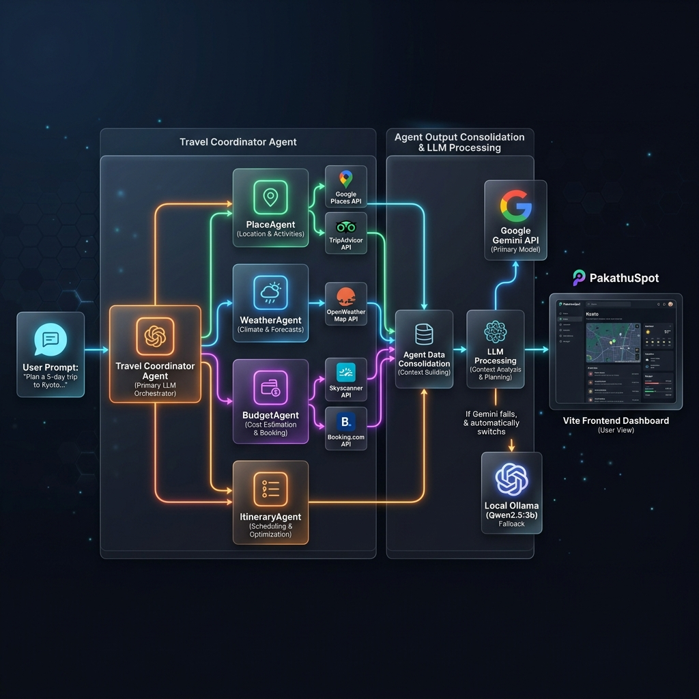
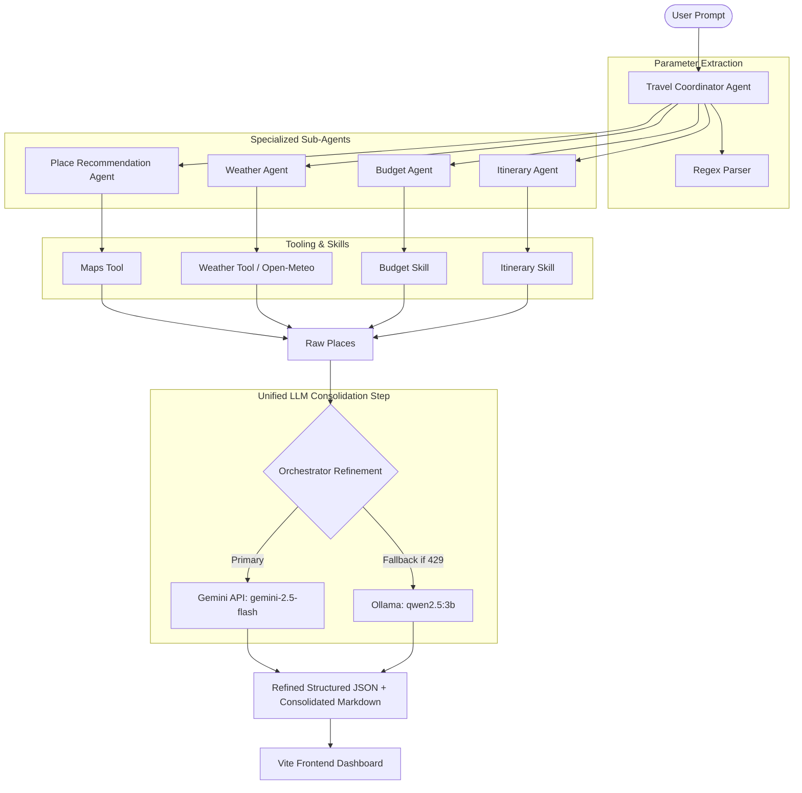
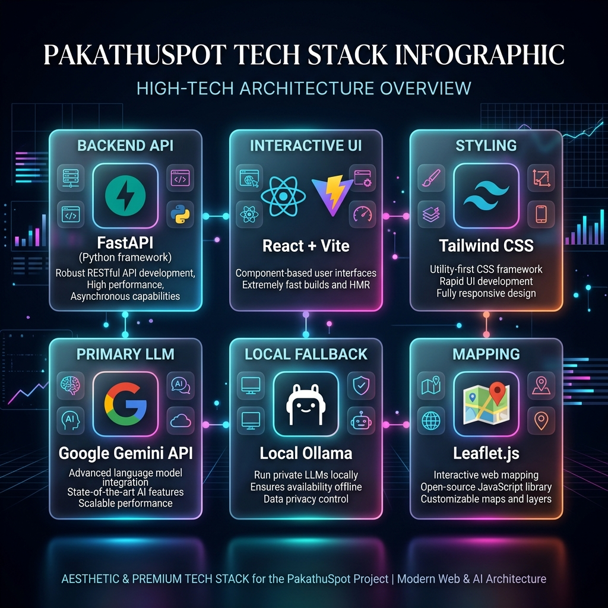
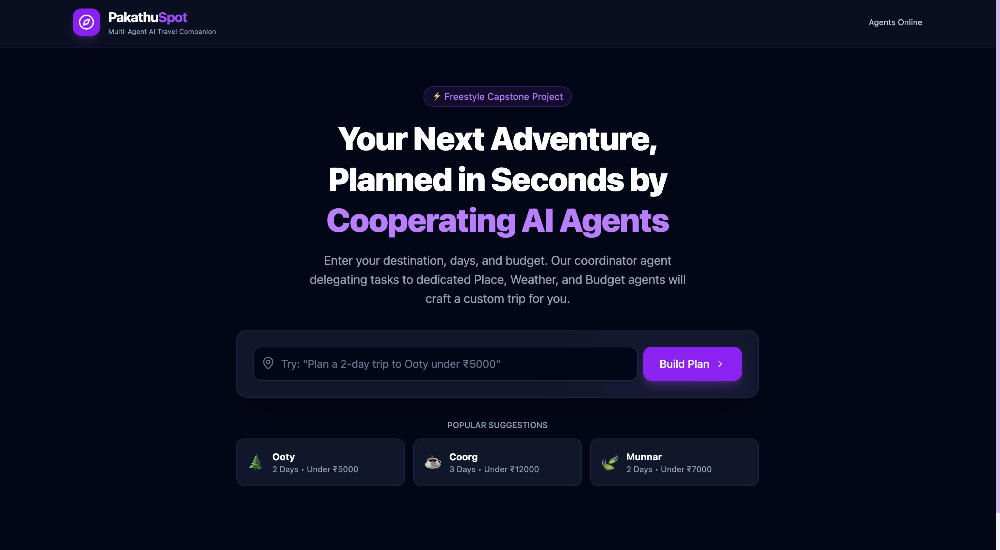
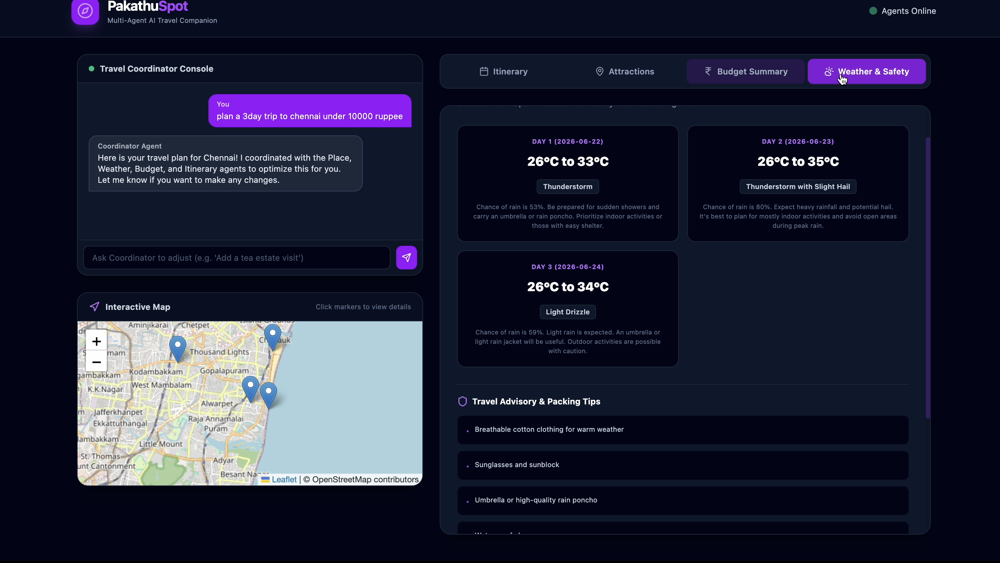
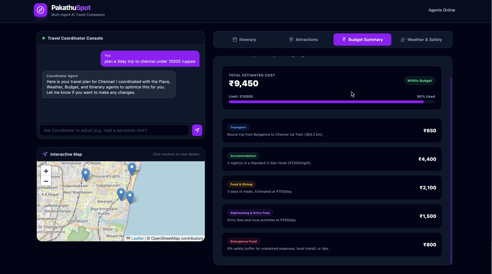
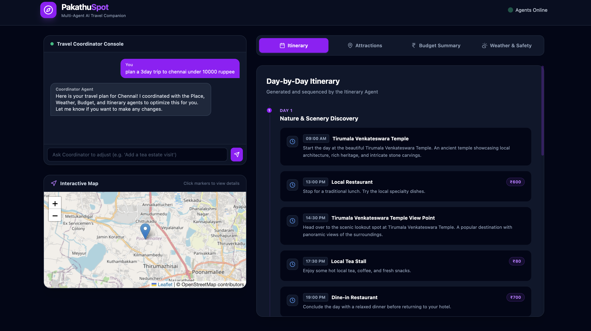
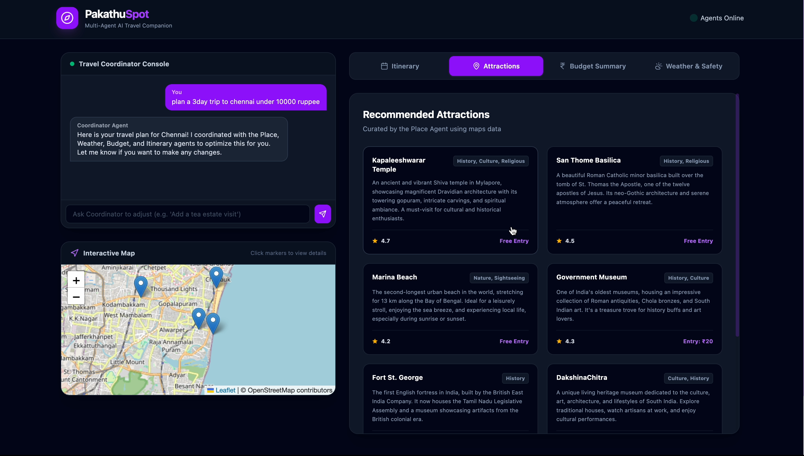

# 🧭 PakathuSpot: Multi-Agent AI Travel Companion

PakathuSpot is a modern, premium, multi-agent AI travel planner designed to curate personalized travel itineraries, calculate precise budgets, and analyze live weather reports. It operates on a smart orchestration architecture that utilizes specialized local agents for tool execution and consolidates results in a **single LLM request** with auto-fallback between the **Google Gemini API** and a **local Ollama instance (Qwen2.5:3b)**.

---

## 🎯 Project Overview

Planning trips often requires hopping between weather channels, maps, budgeting spreadsheets, and itinerary draft documents. **PakathuSpot** unifies this workflow by running specialized AI sub-agents that query external APIs and database mocks, consolidating all outputs into a single, cohesive, beautiful dashboard. 

It is designed to be highly responsive, resilient to API rate limits, and ready to serve both online via Gemini and offline via Ollama.

---

## ✨ Features

- **📍 Dynamic Place Recommendation:** Automatically recommends top local attractions based on your destination. Discards generic mock placeholders and generates real locations (e.g. Kapaleeshwarar Temple, Marina Beach for Chennai) dynamically using LLM knowledge.
- **🌤️ Live Weather Integration:** Fetches real-time forecasts, temperatures, and precipitation probabilities from the **Open-Meteo API** to curate daily advice and packing suggestions.
- **💰 Smart Budget Estimation:** Calculates transport costs (rail, road, flights) and local stay expenditures based on travel modes and distances, dynamically adjusting recommendations to fit within your maximum budget.
- **📅 Detailed Hourly Itinerary:** Generates themed day-by-day hourly schedules.
- **🤖 Unified Single-Call LLM Processing:** Combines Place, Weather, Budget, and Itinerary data into exactly **one LLM call** per trip to prevent 429 Rate Limits and align context.
- **🔄 Local Ollama Fallback:** Automatically redirects planning requests to a local Ollama server running `qwen2.5:3b` if the Gemini API rate limit is exceeded.
- **🗺️ Interactive Map View:** Displays locations on an interactive **Leaflet.js Map** matching coordinates directly.
- **⚡ Glassmorphic Dark UI:** Built with a premium, sleek dark-mode user interface using Vite, React, TailwindCSS, and Lucide Icons.

### Architecture Diagram


## 🤖 Multi-Agent Architecture Diagram

Here is the visual architecture diagram representing the orchestration flow of a request in PakathuSpot:

### Detail Flow Graph



---

## 🤖 Google Agent Development Kit (ADK) Integration

PakathuSpot aligns with **Google ADK** design principles by declaring lightweight, native `google.adk.Agent` objects inside our specialized agent classes. This formalizes agent definitions, descriptions, tools, and sub-agent hierarchies while preserving our high-performance FastAPI orchestration pipeline.

### Agent Declarations & Tool Mapping

1. **Place Recommendation Agent (`PlaceRecommendationAgent`):**
   - **ADK Agent Name:** `PlaceAgent`
   - **Tools/Skills:** `recommend_places`
2. **Weather Agent (`WeatherAgent`):**
   - **ADK Agent Name:** `WeatherAgent`
   - **Tools/Skills:** `get_weather_forecast`, `travel_advice`
3. **Budget Agent (`BudgetAgent`):**
   - **ADK Agent Name:** `BudgetAgent`
   - **Tools/Skills:** `estimate_budget`
4. **Itinerary Agent (`ItineraryAgent`):**
   - **ADK Agent Name:** `ItineraryAgent`
   - **Tools/Skills:** `generate_itinerary`
5. **Coordinator Agent (`TravelCoordinatorAgent`):**
   - **ADK Agent Name:** `TravelCoordinatorAgent`
   - **Sub-agents:** `[PlaceAgent, WeatherAgent, BudgetAgent, ItineraryAgent]`

### Code Example: Declaring an ADK Agent

```python
from google.adk import Agent
from skills.recommendation_skill import recommend_places

class PlaceRecommendationAgent:
    def __init__(self):
        # Initialize agent details...
        self.adk_agent = Agent(
            name="PlaceAgent",
            description="Recommends tourist attractions for a given destination.",
            tools=[recommend_places]
        )
```

### Code Example: Coordinator Orchestration with Sub-agents

```python
from google.adk import Agent

class TravelCoordinatorAgent:
    def __init__(self):
        # Initialize sub-agents
        self.place_agent = PlaceRecommendationAgent()
        self.weather_agent = WeatherAgent()
        self.budget_agent = BudgetAgent()
        self.itinerary_agent = ItineraryAgent()
        
        # Define ADK Agent orchestrating the sub-agents
        self.adk_agent = Agent(
            name="TravelCoordinatorAgent",
            description="Orchestrates PlaceAgent, WeatherAgent, BudgetAgent, and ItineraryAgent to build a consolidated travel plan.",
            sub_agents=[
                self.place_agent.adk_agent,
                self.weather_agent.adk_agent,
                self.budget_agent.adk_agent,
                self.itinerary_agent.adk_agent
            ]
        )
```

---

## 📂 Project Structure

```bash
pakathuspot/
├── agents/                  # AI Agent logic
│   ├── coordinator.py       # Orchestration agent (handles Gemini & Ollama fallback)
│   ├── place_agent.py       # Handles attraction retrieval
│   ├── weather_agent.py     # Pulls weather forecasts
│   ├── budget_agent.py      # Computes stay/travel costs
│   └── itinerary_agent.py   # Curates day schedules
├── frontend/                # React Vite SPA Frontend
│   ├── src/
│   │   ├── App.jsx          # Main dashboard component
│   │   └── main.jsx         # React DOM Entrypoint
│   └── package.json
├── skills/                  # Core algorithmic utilities (Mock database + calculation helpers)
│   ├── advice_skill.py
│   ├── budget_skill.py
│   ├── itinerary_skill.py
│   └── recommendation_skill.py
├── tools/                   # Live external APIs & MCP server integrations
│   ├── distance_tool.py     # Geodesic distance calculator
│   ├── maps_tool.py         # Mock attractions database
│   ├── weather_tool.py      # Nominatim Geocoder & Open-Meteo API
│   └── mcp_server.py        # Model Context Protocol Server wrapper
├── .env                     # Local environment file (API keys & configurations)
├── pyrefly.toml             # Pyrefly linter configurations
├── main.py                  # FastAPI server entry point
└── requirements.txt         # Python project dependencies
```

---
## 🔌 MCP Integration

PakathuSpot exposes travel tools through a FastMCP server.

Available MCP Tools:
- nearby_places
- weather_forecast
- distance_calculator

Compatible Clients:
- Claude Desktop
- Cursor
- Zed
- MCP-compatible agents

## 🛠️ Technology Stack

Here is the visual summary of the technology stack powering PakathuSpot:

### Technology Stack


| Component | Technology | Description |
| :--- | :--- | :--- |
| **Backend Framework** | FastAPI | High-performance asynchronous Python API |
| **Frontend Framework** | React + Vite | Fast compilation and responsive SPA rendering |
| **CSS & Icons** | TailwindCSS + Lucide Icons | Beautiful modern styles and UI elements |
| **AI SDK** | Google GenAI SDK | Native `google-genai` integration for Gemini |
| **Local LLM Runner** | Ollama | Runs `qwen2.5:3b` offline on host hardware |
| **Mapping Layer** | Leaflet.js | Interactive vector mapping |
| **Environment** | python-dotenv | Secure variable management |

---
## 🚀 Antigravity Principles

PakathuSpot follows agentic design principles :

- Task decomposition
- Tool usage
- Agent specialization
- Coordinator orchestration
- Structured outputs
- Fallback reasoning using Gemini and Ollama

Instead of one large model performing all work, specialized agents solve individual tasks and the Coordinator Agent combines their results into a final travel plan.

## ⚙️ Installation Guide

### Prerequisites
- **Python 3.10+**
- **Node.js 18+**
- **Ollama** (for local fallback)

### Step 1: Clone and Setup Virtual Environment
```bash
git clone <repository-url>
cd pakathuspot
python3 -m venv .venv
source .venv/bin/activate
pip install -r requirements.txt
```

### Step 2: Configure Environment Variables
Create a `.env` file in the root directory:
```env
# Gemini API Key (Required for live Gemini features)
GEMINI_API_KEY=your_gemini_api_key_here

# Server configuration
PORT=8000
HOST=0.0.0.0
```

### Step 3: Install Frontend Dependencies
```bash
cd frontend
npm install
cd ..
```

---

## 🦙 Ollama Setup Instructions

If the Gemini API hits a rate limit or goes offline, the Travel Coordinator falls back to your local Ollama instance.

1. Download and install Ollama from [ollama.com](https://ollama.com).
2. Start the Ollama application on your machine.
3. Open your terminal and pull the Qwen model:
   ```bash
   ollama pull qwen2.5:3b
   ```
4. Verify that Ollama is running locally:
   ```bash
   curl http://127.0.0.1:11434/api/tags
   ```
   *(You should see `"qwen2.5:3b"` in the list of models).*

---

## 🚀 Running the Project

### Running the Backend
From the root directory with your `.venv` active:
```bash
uvicorn main:app --reload --port 8000
```
The API documentation will be available at [http://localhost:8000/docs](http://localhost:8000/docs).

### Running the Frontend
In a new terminal window:
```bash
cd frontend
npm run dev
```
Open your browser and navigate to [http://localhost:5173](http://localhost:5173).

### Running the MCP Server
PakathuSpot exposes its tools through a Model Context Protocol (MCP) server for integration with Cursor, Claude Desktop, and other client environments:
```bash
.venv/bin/python tools/mcp_server.py
```

---

## 🔌 API Endpoints

### `POST /api/chat`
Handles conversational planning queries, triggers agent pipelines, and outputs a refined structured JSON plan.
- **Request Body:**
  ```json
  {
    "message": "Plan a 3-day trip to Chennai under ₹10000"
  }
  ```
- **Response Shape:**
  ```json
  {
    "destination": "Chennai",
    "days": 3,
    "budget_limit": 10000.0,
    "origin": "Bangalore",
    "recommended_places": [...],
    "budget_breakdown": {...},
    "weather_report": {...},
    "itinerary": [...],
    "travel_advice": [...],
    "consolidated_report": "# Trip Overview..."
  }
  ```

### `GET /api/health`
Checks health status of the backend API, Gemini configuration, and MCP server activity.

---

## 🛡️ Security Features

- **No Hardcoded API Keys:** All keys are injected through the environment (`.env`) and loaded dynamically at runtime.
- **CORS Handling:** Restricted middleware limits API exposure to trusted origins during production builds.
- **Deterministic Key Masking:** Masked logging outputs protect sensitive API keys in stdout.
- **Linter Enforced Types:** Type definitions and dependencies are statically validated via Pyrefly configs.

---

## ☁️ Deployment Guide

### Single-Service Hosting via FastAPI
To simplify production hosting, you can package both frontend and backend to run on a single port (e.g. Render, Railway, or Google Cloud Run):
1. Build the production React frontend static bundle:
   ```bash
   cd frontend
   npm run build
   cd ..
   ```
2. Deploy the FastAPI repository to your server provider. The backend automatically serves the compiled frontend static files from `frontend/dist` on the root route `/`.

---

## 🔮 Future Enhancements

- **🗺️ Leaflet Custom Routing:** Add visual path lines connecting attractions in the day-by-day sequence.
- **📧 Export as PDF:** Allow users to download the consolidated markdown report as a formatted travel PDF.
- **🏨 Live Hotel Booking integration:** Attach referral booking widgets to recommended accommodation stays.

---

## 📸 Screenshots Section

### Home Page


### Weather Analysis


### Budget Planning


### Itinerary Generation


### Attractions Recommendations


### Architecture Diagram


### Technology Stack


## ✍️ Author Section

Created and maintained by **Ranjitkumar** (freestyle capstone track). 
Feel free to connect or contribute! 🚀
